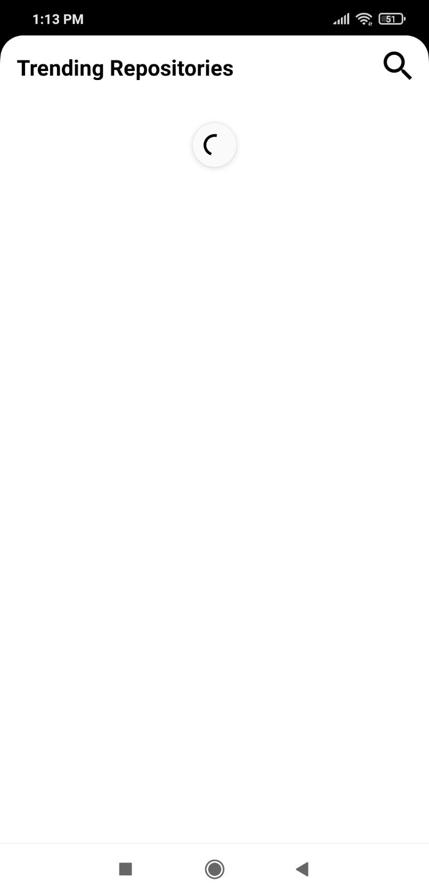
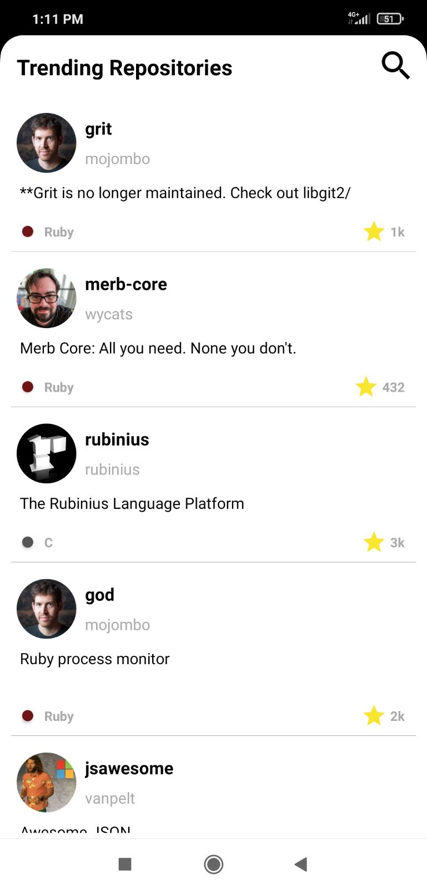
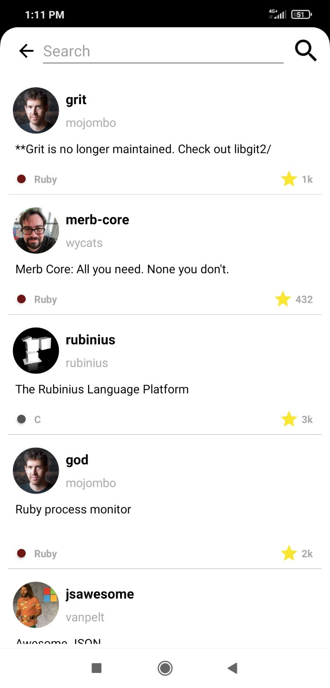
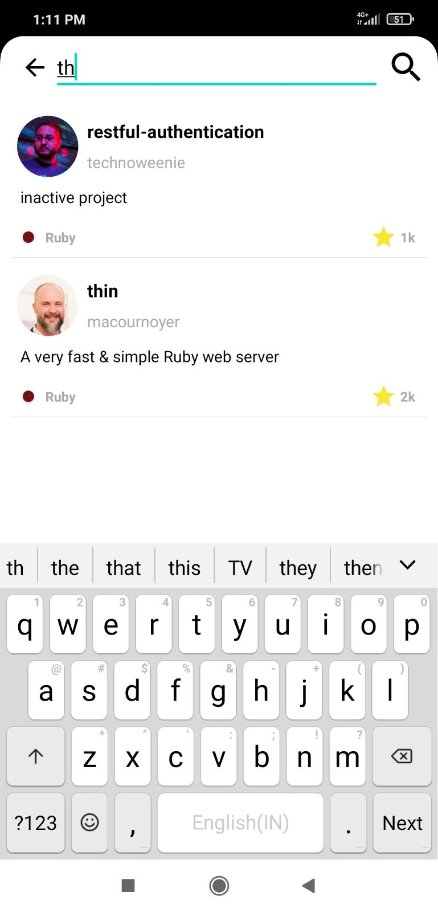
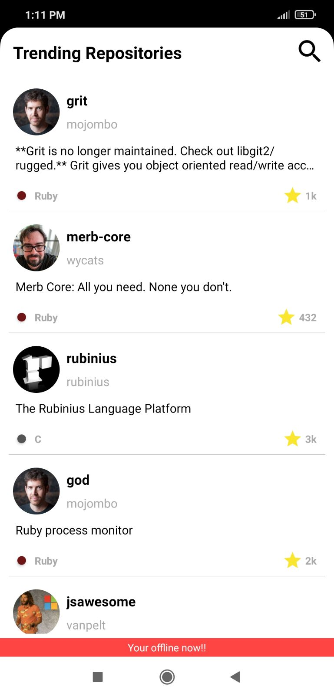
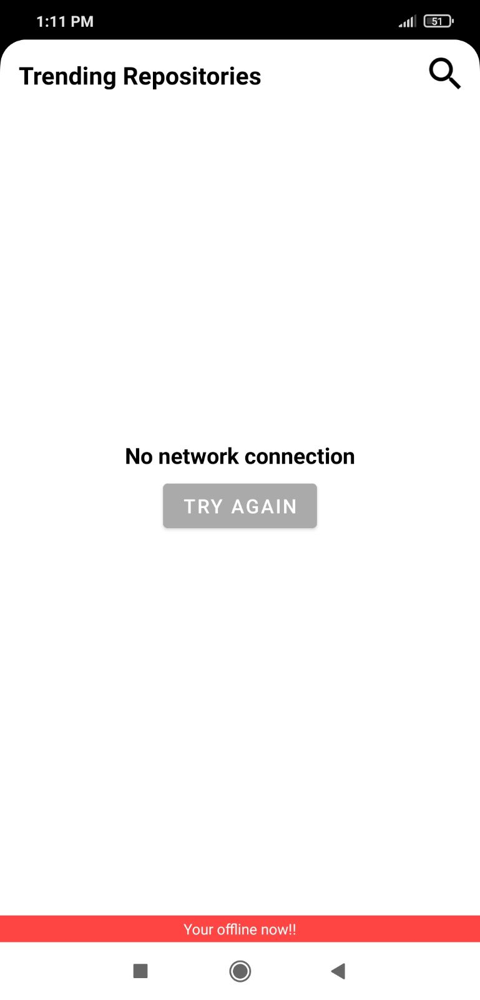

## Description

    This Application is to display the public repositaries received from the GitHub REST API with following features
          1. Search to filter the repositories
          2. Pull to refresh option to force fetch repositories from remote.
          3. Offline Support.
          4. Displays the network state.
 
 ## Technologies Used
 
  **1.Retrofit**
      
      Dependencies :  implementation 'com.squareup.retrofit2:retrofit:2.9.0'
                      implementation 'com.squareup.retrofit2:converter-gson:2.9.0'
                      
      The library provides a powerful framework for authenticating and interacting with APIs and sending network requests with OkHttp.
      
  **2.OkHttp**
  
       Dependencies :  implementation 'com.squareup.okhttp3:okhttp:4.9.1'
                       implementation 'com.squareup.okhttp3:logging-interceptor:4.9.0'
                       
       OKHttp is an Android HTTP client library from Square. It is used for loading data faster and saving bandwidth.  
        
  **3.GSON**
  
       Dependencies :  implementation 'com.google.code.gson:gson:2.8.6'

       Gson is a Java library that can be used to convert Java Objects into their JSON representation. 
       It can also be used to convert a JSON string to an equivalent Java object.
       
  **4.Co-routines**
       
       Dependencies :  implementation 'org.jetbrains.kotlinx:kotlinx-coroutines-android:1.5.2'
                       implementation 'org.jetbrains.kotlinx:kotlinx-coroutines-core:1.5.2'
                       
       It is a concurrency design pattern that you can use on Android to simplify code that executes asynchronously.
       
  **5.Realm**
  
       Plugin :      id 'realm-android'

       Dependencies :  classpath "io.realm:realm-gradle-plugin:10.9.0"
                       implementation 'io.realm:android-adapters:2.1.1'
       
       Realm is an open source object database management system.
       Realm adapter is to load the recycler view directly from the Realm DB and easy for all other sorting and listing operations. 
       
  **6.Glide**
  
       Dependencies :  implementation 'com.github.bumptech.glide:okhttp3-integration:4.11.0'
                       implementation 'com.github.bumptech.glide:glide:4.11.0

       It is a fast and efficient image loading framework for Android
     
  **7.Circular ImageView**

      Dependencies :   implementation 'de.hdodenhof:circleimageview:3.1.0'

      To display the image in a circular format.
      
      
## NOTE :

      1. The rest API provided by GitHub has only 60 times limit for unauthorized user. So i have reduced the RepoList size to 30.
      2. If you want to hit more time add the ACCESS TOKEN generated from GitHub in AppConstants.kt file.
      
## ScreenShot

&nbsp;&nbsp;&nbsp;&nbsp;&nbsp;&nbsp;

&nbsp;&nbsp;&nbsp;&nbsp;&nbsp;&nbsp;

&nbsp;&nbsp;&nbsp;&nbsp;&nbsp;&nbsp;

